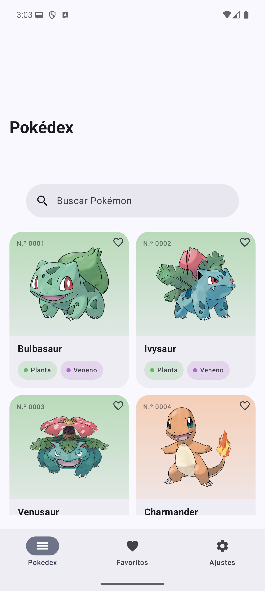
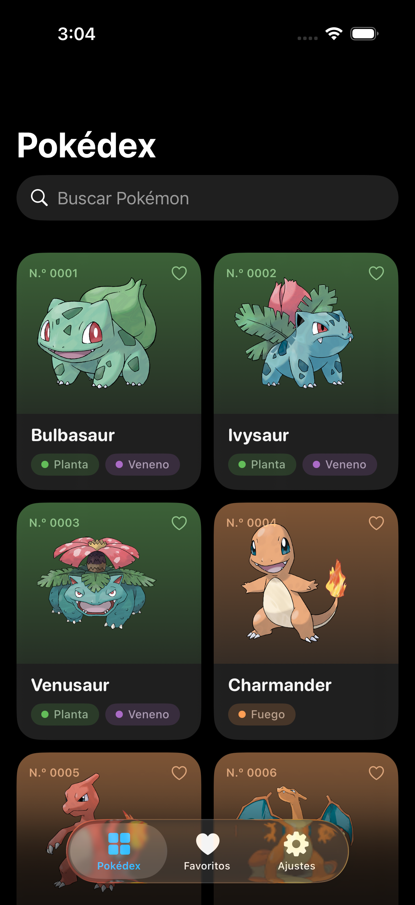
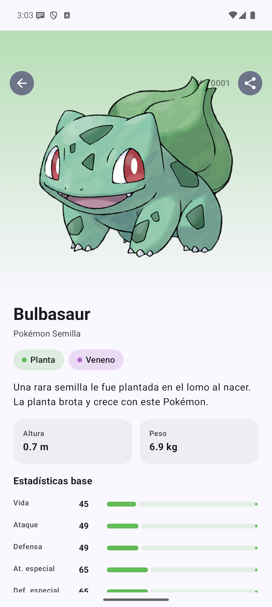
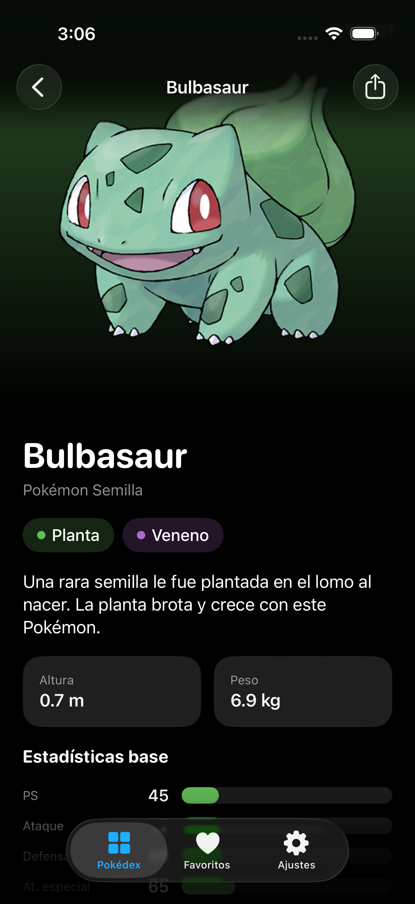

# Pokédex · Kotlin Multiplatform

Una app de Pokédex que consume [PokeAPI](https://pokeapi.co), construida paso a
paso con **Kotlin Multiplatform** e interfaz **nativa** en cada plataforma:
Jetpack Compose en Android y SwiftUI en iOS.

La app está **terminada**: lista paginada, ficha, búsqueda, favoritos que
sobreviven a cerrar la app, ajustes, enlaces profundos, compartir, una
notificación diaria y sesión con correo y contraseña que protege todo lo demás.
Con tests en las dos plataformas, verificación continua y build de release
firmada.

Este repositorio no es una demo terminada: es el hilo de una guía. **Cada
lección deja un tag de git**, así que se puede ver el proyecto exactamente como
estaba al terminar cada paso, y el diff de lo que cambió.

```bash
git checkout l07-crear-proyecto                  # el proyecto recién creado
git diff l07-crear-proyecto l08-primer-commit    # qué añadió la lección siguiente
```

## Cómo se ve

| Android | iOS |
| --- | --- |
|  |  |
|  |  |

Los datos son los mismos y las pantallas no se parecen: se comparte la lógica,
la interfaz se escribe dos veces.

## Qué comparte y qué no

| Capa | Dónde vive |
| --- | --- |
| Modelos, red, base de datos, repositorios, ViewModels | `shared/src/commonMain` |
| Lo que solo existe en una plataforma | `shared/src/androidMain`, `shared/src/iosMain` |
| Interfaz de Android | `androidApp` (Jetpack Compose) |
| Interfaz de iOS | `iosApp` (SwiftUI, proyecto de Xcode) |

`shared` declara además un target `jvm()` que no llega a ninguna tienda: está
para que los tests corran en segundos, sin emulador ni simulador.

## Cómo ejecutarlo

Hace falta un Mac con Apple Silicon, Xcode 26.2 o superior, Android Studio con
el plugin de Kotlin Multiplatform, y un JDK 17.

```bash
# Android
./gradlew :androidApp:installDebug

# Tests, en las tres plataformas
./gradlew :shared:jvmTest :shared:testAndroidHostTest :shared:iosSimulatorArm64Test
```

Para iOS, abrir `iosApp/iosApp.xcodeproj` en Xcode y pulsar Run. Xcode llama a
Gradle solo: no hay que compilar el framework a mano. Antes de la primera
compilación, Gradle descarga la distribución de Kotlin/Native (alrededor de
1,6 GB) en `~/.konan`. Tarda.

## Cuenta de Supabase

La parte de sesión necesita un proyecto de Supabase, que es gratuito. Los pasos
están en [docs/supabase.md](docs/supabase.md). Con `secrets.properties` vacío la
app compila y funciona: solo se queda sin la pantalla de cuenta.

```bash
cp secrets.properties.example secrets.properties   # y rellenar los dos valores
```

## Stack

Kotlin 2.4.20 · AGP 9.4.0 · Gradle 9.7.1 · targets `jvm`, `android`,
`iosArm64` e `iosSimulatorArm64`.

No hay `iosX64`: el simulador de los Mac con Intel se queda fuera porque las
librerías que usa el proyecto no publican ese target.

## Convenciones

- Identificadores y nombres de fichero en inglés; comentarios en español.
- Los comentarios explican **por qué**, no qué, y casi siempre nombran la
  alternativa que se descartó.
- Solo versiones estables, verificadas contra el repositorio Maven.

## El mapa de tags

58 tags, uno por lección que cambia algo. El estado del repositorio al terminar
cada una:

<details>
<summary>Ver los 58 tags</summary>

| Tag | Lección |
| --- | --- |
| `l07-crear-proyecto` | [Crear el proyecto Pokédex](https://aprende-kmp-wheat.vercel.app/aprender/crear-proyecto) |
| `l08-primer-commit` | [Primer commit y repositorio público](https://aprende-kmp-wheat.vercel.app/aprender/primer-commit) |
| `l10-ejecutar-ios` | [Ejecutar en iOS](https://aprende-kmp-wheat.vercel.app/aprender/ejecutar-ios) |
| `l14-primera-dependencia` | [La primera dependencia](https://aprende-kmp-wheat.vercel.app/aprender/primera-dependencia) |
| `l15-expect-actual` | [expect/actual frente a interfaces](https://aprende-kmp-wheat.vercel.app/aprender/expect-actual) |
| `l16-tipos-que-cruzan` | [Los tipos que cruzan a Swift](https://aprende-kmp-wheat.vercel.app/aprender/tipos-que-cruzan) |
| `l17-funciones-que-cruzan` | [Las funciones que cruzan a Swift](https://aprende-kmp-wheat.vercel.app/aprender/funciones-que-cruzan) |
| `l18-coroutines-en-common` | [Corrutinas en commonMain](https://aprende-kmp-wheat.vercel.app/aprender/coroutines-en-common) |
| `l19-flow-hasta-swift` | [Un Flow hasta Swift](https://aprende-kmp-wheat.vercel.app/aprender/flow-hasta-swift) |
| `l20-arquitectura-google` | [La arquitectura que recomienda Google](https://aprende-kmp-wheat.vercel.app/aprender/arquitectura-google) |
| `l21-viewmodel-en-ios` | [El mismo ViewModel en iOS](https://aprende-kmp-wheat.vercel.app/aprender/viewmodel-en-ios) |
| `l22-inyeccion-dependencias` | [Inyección de dependencias con Koin](https://aprende-kmp-wheat.vercel.app/aprender/inyeccion-dependencias) |
| `l23-red-y-serializacion` | [Red y serialización con PokeAPI](https://aprende-kmp-wheat.vercel.app/aprender/red-y-serializacion) |
| `l24-testing-nucleo` | [Testing del núcleo compartido](https://aprende-kmp-wheat.vercel.app/aprender/testing-nucleo) |
| `l25-paginacion` | [Paginación con Paging 3](https://aprende-kmp-wheat.vercel.app/aprender/paginacion) |
| `l26-errores-y-reintentos` | [Errores y reintentos](https://aprende-kmp-wheat.vercel.app/aprender/errores-y-reintentos) |
| `l27-paginacion-ios-puente` | [El puente de paginación para iOS](https://aprende-kmp-wheat.vercel.app/aprender/paginacion-ios-puente) |
| `l28-lista-android` | [La lista en Android](https://aprende-kmp-wheat.vercel.app/aprender/lista-android) |
| `l29-lista-ios` | [La lista en iOS](https://aprende-kmp-wheat.vercel.app/aprender/lista-ios) |
| `l30-integracion-continua` | [Integración continua](https://aprende-kmp-wheat.vercel.app/aprender/integracion-continua) |
| `l31-detalle-nucleo` | [El detalle en el núcleo](https://aprende-kmp-wheat.vercel.app/aprender/detalle-nucleo) |
| `l32-navegacion-nucleo` | [El mapa de pantallas compartido](https://aprende-kmp-wheat.vercel.app/aprender/navegacion-nucleo) |
| `l33-navegacion-android` | [Navegación en Android con Navigation 3](https://aprende-kmp-wheat.vercel.app/aprender/navegacion-android) |
| `l34-navegacion-ios` | [Navegación en iOS con NavigationStack](https://aprende-kmp-wheat.vercel.app/aprender/navegacion-ios) |
| `l35-busqueda-nucleo` | [Búsqueda en el núcleo](https://aprende-kmp-wheat.vercel.app/aprender/busqueda-nucleo) |
| `l36-busqueda-pantallas` | [La barra de búsqueda en las dos apps](https://aprende-kmp-wheat.vercel.app/aprender/busqueda-pantallas) |
| `l37-persistencia` | [Persistencia con Room 3](https://aprende-kmp-wheat.vercel.app/aprender/persistencia) |
| `l38-favoritos-nucleo` | [Favoritos en el núcleo](https://aprende-kmp-wheat.vercel.app/aprender/favoritos-nucleo) |
| `l39-favoritos-android` | [Favoritos en Android](https://aprende-kmp-wheat.vercel.app/aprender/favoritos-android) |
| `l40-pestanas-android` | [Pestañas en Android](https://aprende-kmp-wheat.vercel.app/aprender/pestanas-android) |
| `l41-favoritos-ios` | [Favoritos en iOS](https://aprende-kmp-wheat.vercel.app/aprender/favoritos-ios) |
| `l42-migraciones` | [Migraciones de base de datos](https://aprende-kmp-wheat.vercel.app/aprender/migraciones) |
| `l43-ajustes-nucleo` | [Ajustes en el núcleo](https://aprende-kmp-wheat.vercel.app/aprender/ajustes-nucleo) |
| `l44-ajustes-android` | [Ajustes en Android](https://aprende-kmp-wheat.vercel.app/aprender/ajustes-android) |
| `l45-ajustes-ios` | [Ajustes en iOS](https://aprende-kmp-wheat.vercel.app/aprender/ajustes-ios) |
| `l46-deep-links-android` | [Deep links en Android](https://aprende-kmp-wheat.vercel.app/aprender/deep-links-android) |
| `l47-deep-links-ios` | [Deep links en iOS](https://aprende-kmp-wheat.vercel.app/aprender/deep-links-ios) |
| `l48-compartir` | [Compartir un Pokémon](https://aprende-kmp-wheat.vercel.app/aprender/compartir) |
| `l49-pokemon-del-dia-nucleo` | [El Pokémon del día en el núcleo](https://aprende-kmp-wheat.vercel.app/aprender/pokemon-del-dia-nucleo) |
| `l50-notificaciones-android` | [Notificaciones en Android](https://aprende-kmp-wheat.vercel.app/aprender/notificaciones-android) |
| `l51-segundo-plano-android` | [Trabajo en segundo plano en Android](https://aprende-kmp-wheat.vercel.app/aprender/segundo-plano-android) |
| `l52-notificaciones-ios` | [Notificaciones en iOS](https://aprende-kmp-wheat.vercel.app/aprender/notificaciones-ios) |
| `l53-supabase-setup` | [Preparar Supabase](https://aprende-kmp-wheat.vercel.app/aprender/supabase-setup) |
| `l54-config-por-entorno` | [Configuración y secretos por entorno](https://aprende-kmp-wheat.vercel.app/aprender/config-por-entorno) |
| `l55-auth-nucleo` | [Autenticación en el núcleo](https://aprende-kmp-wheat.vercel.app/aprender/auth-nucleo) |
| `l56-auth-refresh` | [Refrescar el token sin duplicados](https://aprende-kmp-wheat.vercel.app/aprender/auth-refresh) |
| `l57-almacenamiento-seguro` | [Guardar los tokens](https://aprende-kmp-wheat.vercel.app/aprender/almacenamiento-seguro) |
| `l58-auth-android` | [Pantallas de sesión en Android](https://aprende-kmp-wheat.vercel.app/aprender/auth-android) |
| `l59-auth-ios` | [Pantallas de sesión en iOS](https://aprende-kmp-wheat.vercel.app/aprender/auth-ios) |
| `l60-cuenta-usuario` | [La cuenta del usuario](https://aprende-kmp-wheat.vercel.app/aprender/cuenta-usuario) |
| `l61-pruebas-ui-android` | [Pruebas de interfaz en Android](https://aprende-kmp-wheat.vercel.app/aprender/pruebas-ui-android) |
| `l62-pruebas-ui-ios` | [Pruebas de interfaz en iOS](https://aprende-kmp-wheat.vercel.app/aprender/pruebas-ui-ios) |
| `l63-depurar-medir` | [Depurar, medir y adelgazar](https://aprende-kmp-wheat.vercel.app/aprender/depurar-medir) |
| `l64-accesibilidad` | [Accesibilidad](https://aprende-kmp-wheat.vercel.app/aprender/accesibilidad) |
| `l65-i18n` | [Dos idiomas](https://aprende-kmp-wheat.vercel.app/aprender/i18n) |
| `l66-produccion-android` | [Producción en Android](https://aprende-kmp-wheat.vercel.app/aprender/produccion-android) |
| `l67-produccion-ios` | [Producción en iOS](https://aprende-kmp-wheat.vercel.app/aprender/produccion-ios) |
| `l68-checklist-de-tiendas` | [Checklist de las dos tiendas](https://aprende-kmp-wheat.vercel.app/aprender/checklist-de-tiendas) |
</details>

Las lecciones que no cambian ficheros —las de conceptos y las de instalación— no
llevan tag, y por eso la numeración salta.

## La guía

El paso a paso que construye esto, lección a lección, está en
**[aprende-kmp-wheat.vercel.app](https://aprende-kmp-wheat.vercel.app)**. Cada
lección enlaza a su tag y al diff con el anterior, y todo el código que aparece
allí sale literal de este repositorio: hay un verificador que lo comprueba.

## Licencia

MIT. Ver [LICENSE](LICENSE).
